# AI Text Humanizer

Transform AI-generated content into natural, human-like writing with our advanced text humanization tool. This project addresses the growing need for AI-generated content that feels authentic and human-written.

## 🎯 Problem Statement

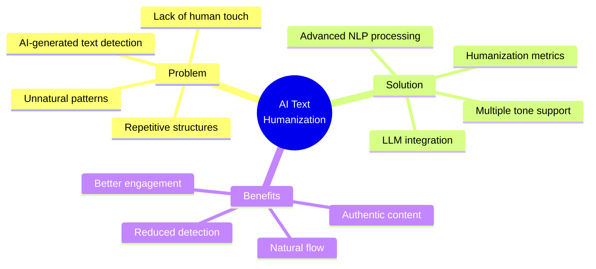

## 🌟 Core Features

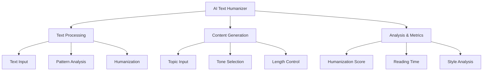

## 📊 System Architecture

### High-Level Architecture

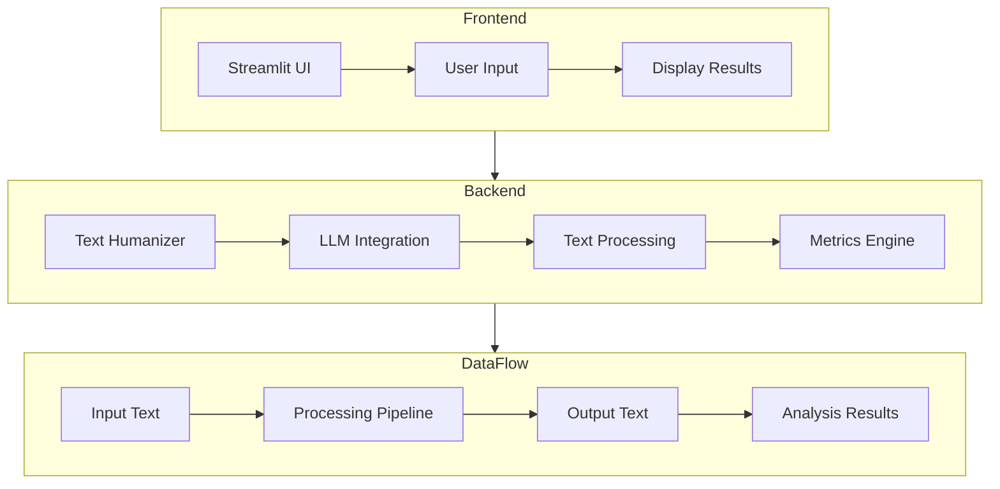

### Detailed Component Interaction

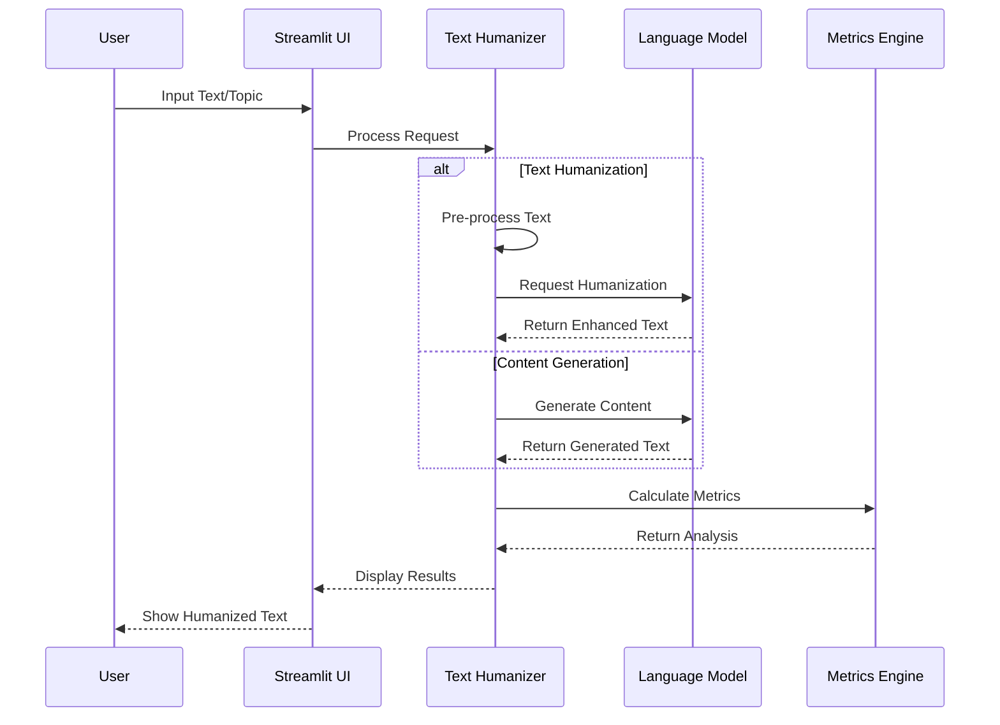

## 🔄 Processing Pipeline

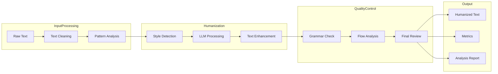

## 📈 Metrics and Analysis

### Humanization Scoring System

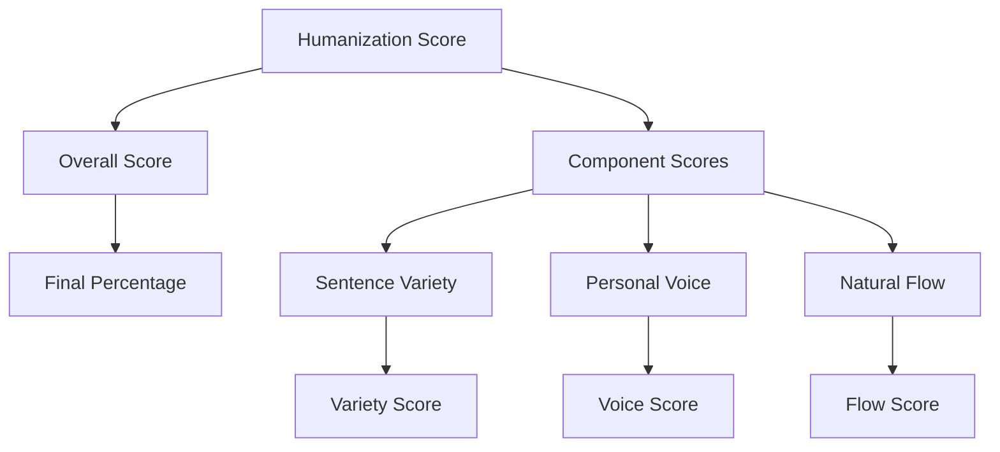

### Analysis Pipeline

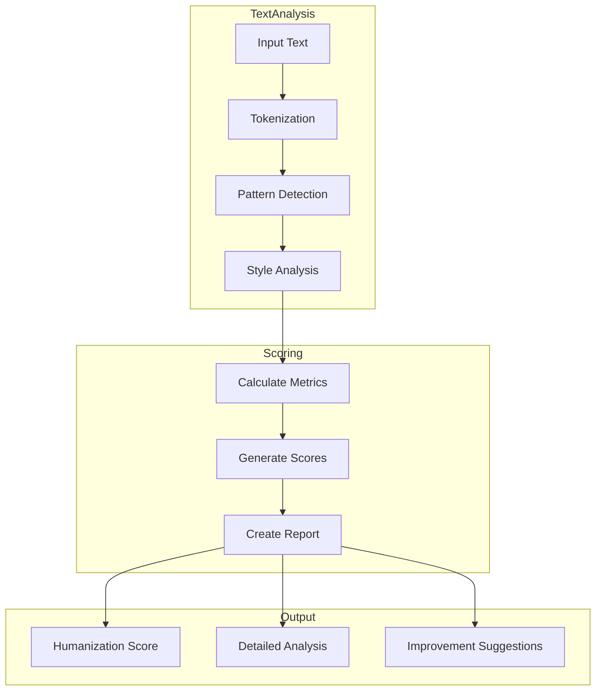

## 🛠️ Technical Implementation

### Technology Stack

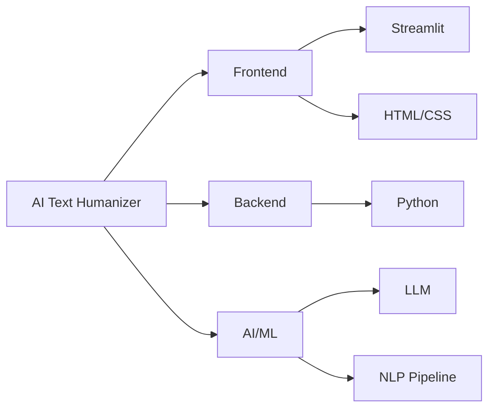

## 📦 Installation and Setup

1. Clone the repository:
```bash
git clone https://github.com/srikrishnavansi/Humanize.git
cd humanizer
```

2. Create and activate a virtual environment:
```bash
python -m venv .venv
source .venv/bin/activate  # On Windows: .venv\Scripts\activate
```

3. Install dependencies:
```bash
pip install -r requirements.txt
```

## 🚀 Usage Guide

### Basic Usage

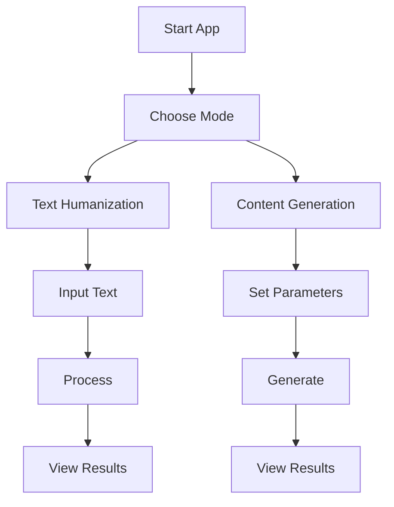

### Advanced Features

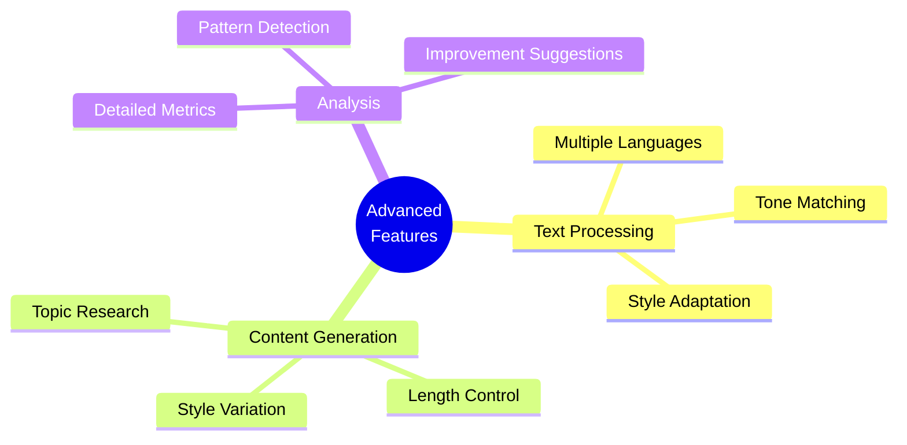

## 🔍 How It Works

### Text Humanization Process

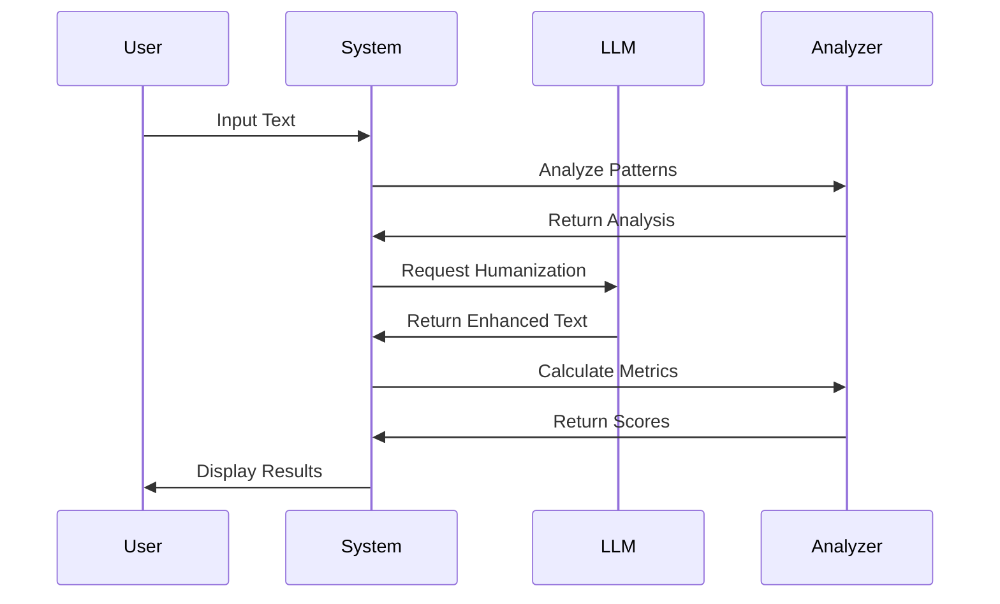

### Content Generation Process

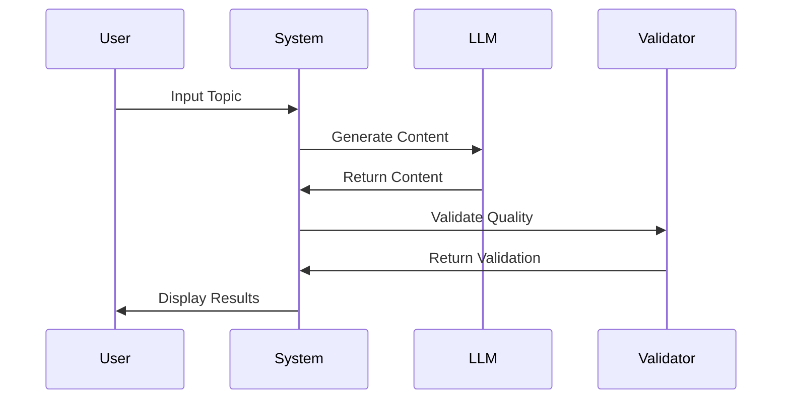

## 📊 Performance Metrics

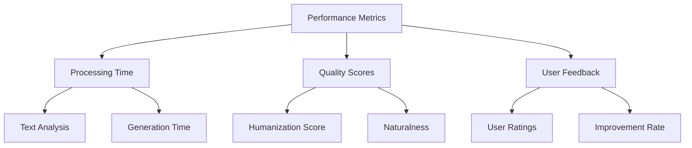

## 🔮 Future Enhancements

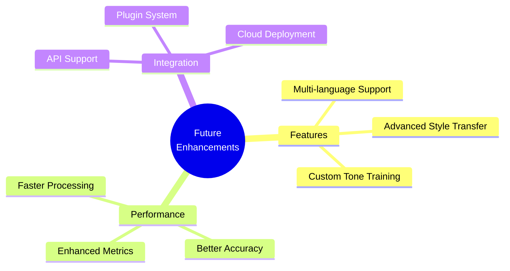
## ⚠️ Ethical Considerations

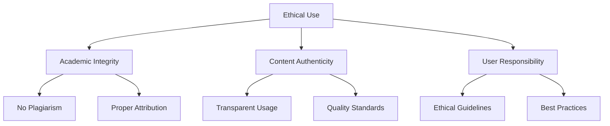
---

*This tool is designed for ethical use only. Please use responsibly and avoid any form of academic dishonesty.* 
